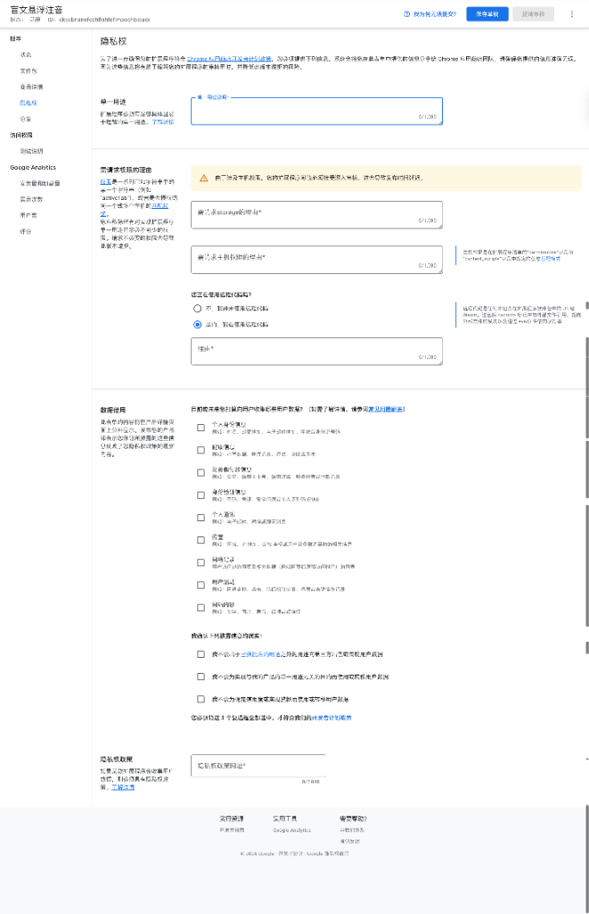

<p align="center">
  
</p>

<h1 align="center">SixKey ⠎⠊⠭⠅⠑⠽</h1>

<p align="center">
  <strong>盲文悬浮注音</strong><br>
  Chrome 浏览器插件 + macOS 盲文输入法
</p>

<p align="center">
  <a href="README.md">English</a> · <a href="README_zh.md">中文</a>
</p>

---



一款 macOS 盲文输入法 + Chrome 浏览器插件，将标准 QWERTY 键盘变为 6 键盲文打字机，并提供网页中文实时盲文注音。

## ✨ 功能特性

| 功能 | 说明 |
|------|------|
| 🖱️ 悬浮注音 | 鼠标悬停中文即显示盲文点位图 |
| 🔄 双向转换器 | 中文 ↔ 盲文实时互转 |
| 🎵 声调标注 | 支持四声声调显示 |
| 🔤 英文盲文 | 支持 Grade 1 国际盲文 |
| 📖 对照表 | 声母/韵母/声调/英文完整对照 |
| 🌙 深色模式 | 全界面深色主题 |
| ⌨️ RIME 方案 | 6 键和弦输入盲文 |

## ✋ 键盘布局

用 **SDF-JKL** 六个键同时按下（和弦），如同 [Perkins 盲文打字机](https://en.wikipedia.org/wiki/Perkins_Brailler)。

```
┌───┐ ┌───┐ ┌───┐       ┌───┐ ┌───┐ ┌───┐
│ S │ │ D │ │ F │       │ J │ │ K │ │ L │
│ 3 │ │ 2 │ │ 1 │       │ 4 │ │ 5 │ │ 6 │
└───┘ └───┘ └───┘       └───┘ └───┘ └───┘
  ·     ·     ●           ●     ·     ·     → 点 1+4 = ⠉ (c)
  ·     ●     ●           ·     ·     ·     → 点 1+2 = ⠃ (b)
  ●     ●     ●           ●     ·     ·     → 点 1+2+3+4 = ⠏ (中文 k)
```

| 键 | 点 | 位置 | 十六进制 |
|----|-----|------|---------|
| F  | 1   | 左上 | `0x01`  |
| D  | 2   | 左中 | `0x02`  |
| S  | 3   | 左下 | `0x04`  |
| J  | 4   | 右上 | `0x08`  |
| K  | 5   | 右中 | `0x10`  |
| L  | 6   | 右下 | `0x20`  |

## 🔢 Unicode 编码计算

所有盲文图案对应 Unicode **Braille Patterns** 区块 (`U+2800`–`U+28FF`) 中的唯一字符，计算公式为简单的位相加：

```
Unicode = U+2800 + dot1×0x01 + dot2×0x02 + dot3×0x04 + dot4×0x08 + dot5×0x10 + dot6×0x20
```

**示例**：按 `F` + `D` + `J`（点 1, 2, 4）：
```
U+2800 + 0x01 + 0x02 + 0x08 = U+280B → ⠋ (f)
```

## 🌏 支持的盲文体系

### 中文 — 现行盲文 (GB/T 15720)

基于汉语拼音的表音盲文：
- **21 声母**：b ⠃, p ⠏, m ⠍, f ⠋, d ⠙, t ⠞, …
- **34 韵母**：a ⠔, o ⠢, e ⠄, ai ⠪, ei ⠮, …
- **4 声调**：可选声调标记
- 例如 天 (tiān) = `⠞⠩` (t + ian)

> **注意**：中文盲文是纯表音的——使用相同的 Unicode 点阵字符，但映射到拼音声母/韵母而非英文字母。

### 英文 — Grade 1 (EBAE)

字母与盲文直接映射，每个英文字母对应唯一的盲文点位（如 `a` = 点 1 = ⠁）。

## 📁 项目结构

```
sixkey/
├── extension/          # Chrome 浏览器插件
│   ├── manifest.json   # 扩展配置 (MV3)
│   ├── braille.js      # 核心转换引擎
│   ├── content.js      # 悬浮注音脚本
│   ├── converter.html  # 双向转换器页面
│   ├── reference.html  # 盲文对照表
│   ├── popup.html/js   # 设置弹窗
│   └── privacy.html    # 隐私政策
├── rime/               # RIME 输入法方案
├── data/               # 盲文映射数据
├── docs/               # 文档
└── pack.sh             # Chrome 商店打包脚本
```

## 🗺️ 路线图

- [x] 核心盲文映射数据（中文 & 英文）
- [x] Chrome 浏览器悬浮注音插件
- [x] 双向盲文转换器
- [x] RIME 盲文输入方案
- [ ] 原生 macOS 输入法 (`IMKInputController`)
- [ ] 互动式盲文学习模式
- [ ] 双拼盲文支持
- [ ] 粤语/注音盲文支持

## 📚 参考资料

- [Liblouis](https://github.com/liblouis/liblouis) — 开源盲文翻译库
- [RIME 中州韵](https://rime.im/) — 可定制输入法引擎
- [GB/T 15720-1995](https://www.moe.gov.cn/) — 中国盲文国家标准
- [Unicode Braille Patterns](https://www.unicode.org/charts/PDF/U2800.pdf) — U+2800–U+28FF

## 📜 许可证

MIT
